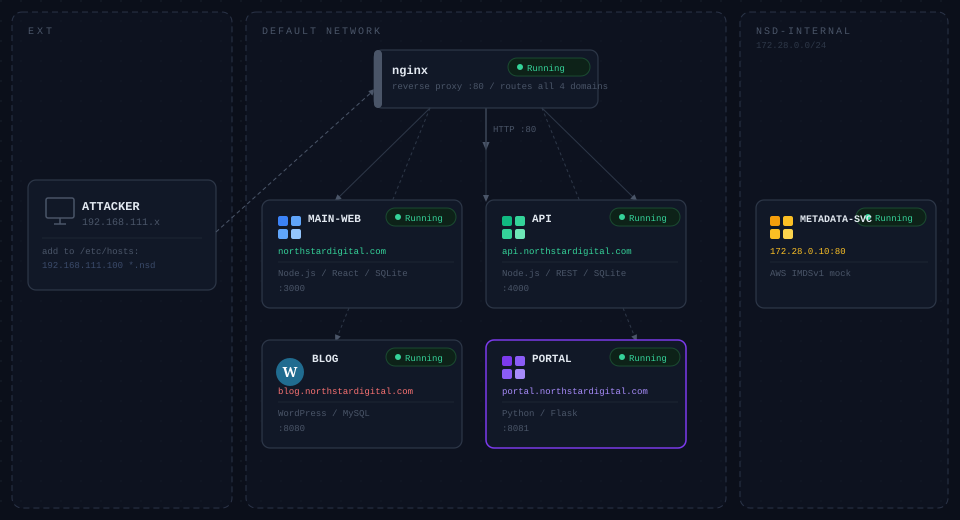

# NorthstarDigital Inc. — Pentest Lab



> Deliberately vulnerable multi-app environment simulating a fictional Philippine fintech company.

**For authorized security research and educational use only.**

## Quick Start

**Requirements:** Docker + Docker Compose v2

**Step 1 — Clone and run**

```bash
git clone https://github.com/ruur31337/northstardigital-lab.git
cd northstardigital-lab
docker compose up -d
```

Wait **2 minutes** for WordPress to finish installing before opening a browser.

**Step 2 — Add to `/etc/hosts`**

Linux / Mac:

```bash
echo "127.0.0.1 northstardigital.com api.northstardigital.com blog.northstardigital.com portal.northstardigital.com" | sudo tee -a /etc/hosts
```

Windows — open `C:\Windows\System32\drivers\etc\hosts` as Administrator and add:

```
127.0.0.1 northstardigital.com api.northstardigital.com blog.northstardigital.com portal.northstardigital.com
```

## Targets

All apps are accessible on **port 80** via their domain name.

| App | URL |
|-----|-----|
| Main Website | `http://northstardigital.com` |
| REST API | `http://api.northstardigital.com` |
| Company Blog | `http://blog.northstardigital.com` |
| Merchant Portal | `http://portal.northstardigital.com` |

API docs: `http://api.northstardigital.com/api/docs`

## Updating

To pull the latest images and restart:

```bash
docker compose pull
docker compose down -v
docker compose up -d
```

> `-v` is required to wipe the WordPress database volume so it reinstalls cleanly with the correct URLs.

## Troubleshooting

### Blog redirects to `:8080` or shows "Hello world!"

WordPress installed with a wrong URL from a previous run. Fix it without tearing down:

```bash
docker exec northstardigital-lab-blog-db-1 mysql -uwp_blog -pblog_pass_2024 northstar_blog \
  -e "UPDATE wp_options SET option_value='http://blog.northstardigital.com' WHERE option_name IN ('siteurl','home');"
docker compose restart blog
```

Wait ~2 minutes, then refresh the browser.

### API returns 502 / 504

nginx may be pointing to a stale container IP. Restart nginx:

```bash
docker compose restart nginx
```

If it persists, do a full reset:

```bash
docker compose down -v
docker compose pull
docker compose up -d
```

### Any app not responding after first `up -d`

Wait 2 minutes — the API healthcheck must pass before nginx starts proxying, and WordPress needs time to finish its background setup.

## Teardown

```bash
docker compose down -v
```

## docker-compose.yml

```yaml
services:

  # ── Reverse proxy — routes all domains on port 80
  nginx:
    image: ruur1337/nsd-nginx:latest
    ports:
      - "80:80"
    depends_on:
      main-web:
        condition: service_started
      api:
        condition: service_healthy
      blog:
        condition: service_started
      portal:
        condition: service_started
    restart: unless-stopped

  # ── App 1: northstardigital.com (main website)
  main-web:
    image: ruur1337/nsd-main-web:latest
    restart: unless-stopped

  # ── App 2: api.northstardigital.com (REST API)
  api:
    image: ruur1337/nsd-api:latest
    healthcheck:
      test: ["CMD-SHELL", "node -e \"require('http').get('http://localhost:3001/api/docs',r=>process.exit(r.statusCode<500?0:1)).on('error',()=>process.exit(1))\""]
      interval: 5s
      timeout: 5s
      retries: 10
      start_period: 20s
    restart: unless-stopped

  # ── App 3: blog.northstardigital.com (WordPress)
  blog-db:
    image: mysql:5.7
    restart: unless-stopped
    environment:
      MYSQL_DATABASE: northstar_blog
      MYSQL_USER: wp_blog
      MYSQL_PASSWORD: blog_pass_2024
      MYSQL_ROOT_PASSWORD: root_blog_2024
    volumes:
      - blog-db-data:/var/lib/mysql
    healthcheck:
      test: ["CMD", "mysqladmin", "ping", "-h", "localhost", "-uwp_blog", "-pblog_pass_2024"]
      interval: 10s
      timeout: 5s
      retries: 5

  blog:
    image: ruur1337/nsd-blog:latest
    environment:
      WORDPRESS_DB_HOST: blog-db:3306
      WORDPRESS_DB_NAME: northstar_blog
      WORDPRESS_DB_USER: wp_blog
      WORDPRESS_DB_PASSWORD: blog_pass_2024
      WORDPRESS_URL: http://blog.northstardigital.com
      WORDPRESS_PUBLIC_URL: http://blog.northstardigital.com
    volumes:
      - blog-wp:/var/www/html
    depends_on:
      blog-db:
        condition: service_healthy
    restart: unless-stopped

  # ── App 4: portal.northstardigital.com (Merchant Portal)
  portal:
    image: ruur1337/nsd-portal:latest
    extra_hosts:
      - "metadata-service:172.28.0.10"
    networks:
      - default
      - nsd-internal
    depends_on:
      - metadata-service
    restart: unless-stopped

  metadata-service:
    image: ruur1337/nsd-metadata-service:latest
    networks:
      nsd-internal:
        ipv4_address: 172.28.0.10
    restart: unless-stopped

networks:
  default: {}
  nsd-internal:
    driver: bridge
    ipam:
      config:
        - subnet: 172.28.0.0/24

volumes:
  blog-db-data:
  blog-wp:
```
